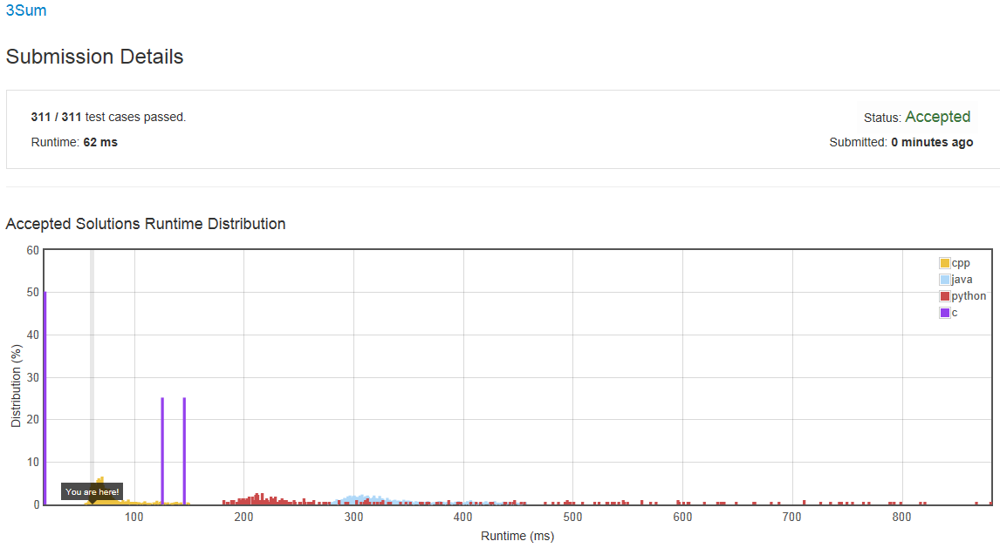
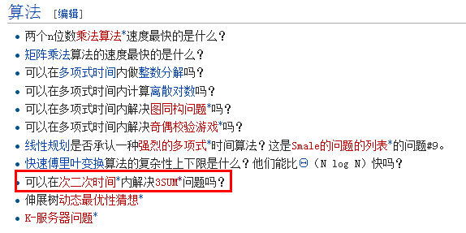

# [3Sum](https://leetcode.com/problems/3sum/)

Given an array S of n integers, are there elements a, b, c in S such that a + b + c = 0? Find all unique triplets in the array which gives the sum of zero.

Note:
Elements in a triplet (a,b,c) must be in non-descending order. (ie, a ≤ b ≤ c)
The solution set must not contain duplicate triplets.
```
For example, given array S = {-1 0 1 2 -1 -4},

    A solution set is:
    (-1, 0, 1)
    (-1, -1, 2)
```
说的意思很简单，就是：给出一个整型数组，从里面找三个数 `a ,b ,c` 并且使 `a+b+c=0` 。找出所有符合条件的三元组解集。并且解集中不能出现重复的解。 


- **[Array](https://leetcode.com/tag/array/)**
- **[Two Pointers](https://leetcode.com/tag/two-pointers/)**


##Solutions

- **[1 3Sum -- 61~69ms](https://leetcode.com/submissions/detail/23151197/)**
    - 首先是对数组进行升序排序，然后逐个选择一个整型，并从剩下的数组元素中选出两个数字，使这三个数字的和为0。
    - 选剩下的两个数字时，第二个数字从第一个数字的下一个数字开始，这是因为，第一个数字及其之前的数字都已进行过查找操作！如果有解，则一定已经找到过了。所以第二个数字从第一个数字的下一个数字开始向后选取；第三个数字从最后一个数字开始向前选取，因为数组已排序，则只要存在，必定能够找到。
    - 按这种思想的代码如下：
    ```cpp
    class Solution {
    public:
        vector<vector<int> > threeSum(vector<int> &num) {
            vector<vector<int> > res;
            if(num.size()<3) return res;//参数检验
            sort(num.begin(),num.end()); //先排序
            
            int beg , end , sum;
            vector<int> tmp(3,0);
            for(int i = 0;i<num.size()-2;++i){
                // 去除重复数字的再次查找，避免结果集合中出现重复解
                if(num[i]>0)break;
                if((i>0) && num[i]==num[i-1]) continue;
                beg = i + 1;
                end = num.size()-1;
                while(beg < end){
                    sum=num[beg] + num[end] + num[i];
                    if( sum< 0)        ++beg;
                    else if(sum > 0)   --end;
                    else{
                        tmp[0] = num[i];
                        tmp[1] = num[beg];
                        tmp[2] = num[end];
                        res.push_back(tmp);
                        // 同样是去除重复数字的再次查找，避免结果集合中出现重复解
                        while(beg<end && num[beg]==tmp[1]) ++beg;
                        while(beg<end && num[end]==tmp[2]) --end;
                        if(beg>=end) break;
                    }
                }
            }
            return res;
        }
    };
    ```
    - 测试集进行测试后：
      
    - 在维基百科里有关于**3Sum**的说明，同时我又去查找了一下**StackOverflow**，发现目前只有这种复杂度为 $O(N^2)$ 的解决方案，还没有更好的解决方法~~~，也可能是我没有找到。维基百科里说的算法思想便是上面的方法，并给出了伪代码：
    ```cpp
    sort(S);
     for i=0 to n-3 do
        a = S[i];
        start = i+1;
        end = n-1;
        while (start < end) do
           b = S[start];
           c = S[end];
           if (a+b+c == 0) then
              output a, b, c;
              // Continue search for all triplet combinations summing to zero.
               start = start + 1
               end = end - 1
           else if (a+b+c > 0) then
              end = end - 1;
           else
              start = start + 1;
           end
        end
     end
    ```
    - 同时，根据维基百科上给出的[未解决的计算机科学问题](http://zh.wikipedia.org/wiki/%E6%9C%AA%E8%A7%A3%E6%B1%BA%E7%9A%84%E8%A8%88%E7%AE%97%E6%A9%9F%E7%A7%91%E5%AD%B8%E5%95%8F%E9%A1%8C)中的**算法**里有这个问题：可以在次二次时间内解决3SUM问题吗？   
      
    


##**附录**
- **[GitHub-LeetCodesOJ](https://github.com/bbxytl/LeetCodesOJ/blob/master/README.md#githubblog--leetcodesoj)** 
- **[GitHub-Blog](http://bbxytl.github.io/)**
