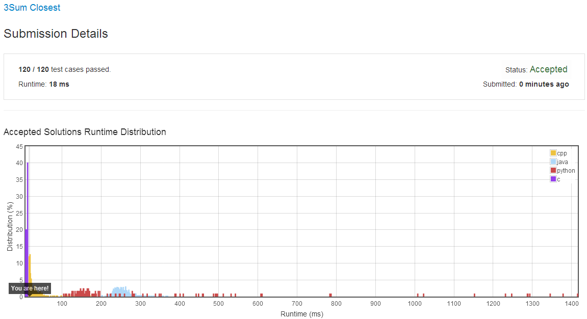
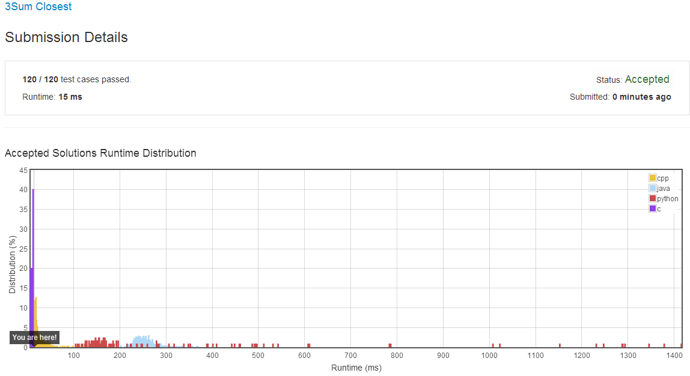

# [3Sum Closest](https://leetcode.com/problems/3sum-closest/)

Given an array S of n integers, find three integers in S such that the sum is closest to a given number, target. Return the sum of the three integers. You may assume that each input would have exactly one solution.
```
For example, given array S = {-1 2 1 -4}, and target = 1.

The sum that is closest to the target is 2. (-1 + 2 + 1 = 2).
```
说的意思很简单，就是：给出一个整型数组，从里面找三个数 `a ,b ,c` 并且使 `a+b+c=0` 。找出所有符合条件的三元组解集。并且解集中不能出现重复的解。 


- **[Array](https://leetcode.com/tag/array/)**
- **[Two Pointers](https://leetcode.com/tag/two-pointers/)**


##Solutions

- **[1 3Sum Closest -- 18ms](https://leetcode.com/submissions/detail/23151197/)**
    - 这题的思想和求 **[3Sum]** 的思想是类似的，因此可以使用同思想来求解。
    - 首先是对数组进行升序排序，然后逐个选择一个整型，并从剩下的数组元素中选出两个数字，求出这三个数字的和 **sum**。
    - 选剩下的两个数字时，第二个数字从第一个数字的下一个数字开始，这是因为，第一个数字及其之前的数字都已进行过查找操作！如果有解，则一定已经找到过了。所以第二个数字从第一个数字的下一个数字开始向后选取；第三个数字从最后一个数字开始向前选取，因为数组已排序，则只要存在，必定能够找到。
    - 比较**sum**和**target**的大小，如果相等，则说明三数和与**target**最近的距离是**0**，这种情况是极限情况，不可能还有比这更近的了，所以可直接返回此**sum**。
    - 如果 `sum != target ` 则判断当前两数之间的距离 `dt=abs(sum-target)`和目前已求得的最短距离 `dis` 哪个更小，如果 `dt<dis` ，则说明出现了一个更接近 **target** 的解。则记录下此解的和 **res** 。
    - 循环结束后，**res** 里记录的便为最接近 **target** 的三数和。
    - 按这种思想的代码如下：
    ```cpp
    class Solution {
    public:
        int threeSumClosest(vector<int> &num, int target) {
            int n=num.size();
            if(n<3)return 0;
            sort(num.begin(),num.end());
            int beg,end,sum=0;
            int dis=INT_MAX;
            int res;
            for(int i=0;i<n-2;++i){
                beg=i+1;
                end=n-1;
                while(beg<end){
                    sum=num[i]+num[beg]+num[end];
                    if(sum==target)return sum;
                    else if(sum<target) ++beg;
                    else --end;
                    int dt=(abs(sum-target));
                    if(dis>dt){
                        dis=dt;
                        res=sum;
                    }
                }
            }
            return res;
        }
    };
    ```
    - 测试集进行测试后：
      


- **[2 3Sum Closest -- 15ms](https://leetcode.com/submissions/detail/23168530/)**
    - 在共享区里，我发现了这样一种解法：
    - 我们刚才的思想是，先确定一个数字来定位，然后再遍历出剩下的两个数字。这里的思想正好是反过来的：先确定两个数字，再找剩下的一个。
    - 先对数组进行排序，定位首尾两数。然后求出新的要找的目标数字 `newTarget = target - (num[start]+num[end])` ，再使用**二分查找**查找剩下的那个数字。使用的**二分查找**返回的数字是找到的比较符合条件的数组中数字的下标。
    - 二分查找方法的时间复杂度是 $O(logN)$
    - 根据查出的数字，求三数和 **curSum** ，比较其与最终要求的**target**的距离是否小于之间的最小距离 **mindiff** ，如果小于，则说明找到一个更小的解，给最小距离 **mindiff** 重新赋值。然后继续下一轮查找。
    - 由以上分析可知，此算法的时间复杂度是 $O(NlogN)$ 。要优于方法1 的 $O(N^2)$ 。
    - 下面是经我改进后的代码：
    ```cpp
    class Solution {
        // 二分查找
        int findTarget(vector<int> &num, int start, int end, int target) {
            if (start==end) return start;
            if (end-start==1)
                return abs(num[end]-target) > abs(num[start]-target) 
                        ? start : end;
            int mid = (start+end)/2;
            if (num[mid]==target)    return mid;
            else if(num[mid]>target) 
                return findTarget(num, start, mid, target);
            else return findTarget(num, mid, end, target);
        }
    public:
        int threeSumClosest(vector<int> &num, int target) {
            int res=0;
            if(num.size()<=3){
                for(auto v : num) res+=v;
                return res;
            }
            sort(num.begin(), num.end());
            int start = 0;
            int end = int(num.size()-1);
            int mindiff = INT_MAX;
            while (start<end-1) {
                int newTarget = target - (num[start] + num[end]);
                int p = findTarget(num, start+1, end-1, newTarget);
                int curSum = num[start] + num[end] + num[p];
                if (curSum == target) {
                    return target;
                }else if(curSum > target) end--;
                        else start++;
                mindiff = abs(mindiff)>abs(target-curSum) ? target-curSum : mindiff;
            }
            res=target-mindiff;
            return res;
        }
    };
    ```
    - 测试集进行测试后：
    


##**附录**
- **[GitHub-LeetCodesOJ](https://github.com/bbxytl/LeetCodesOJ/blob/master/README.md#githubblog--leetcodesoj)** 
- **[GitHub-Blog](http://bbxytl.github.io/)**
